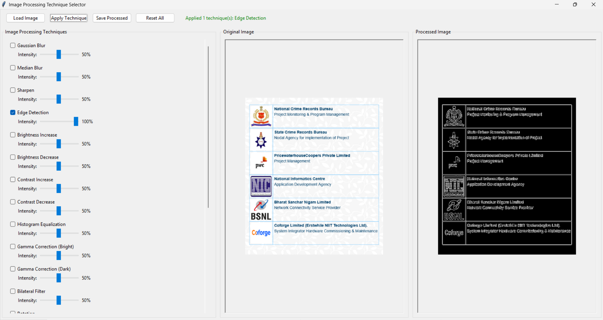
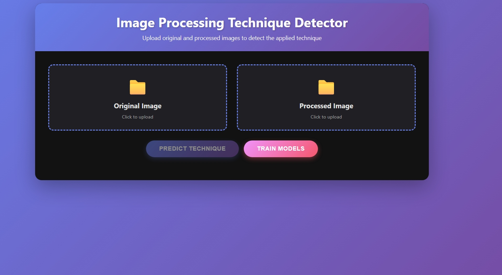

# Shiv_Dutt_Choubey_250103002051

# AI Image Transformation Technique Predictor

Link to Colab Notebook: https://colab.research.google.com/drive/1L-8paLzXKksECkQG0Mwli17zUnMhUOjH?usp=sharing

Problem Definition
Goal:
To automate the identification of image processing techniques applied to an image layer.
Given the images, the project predicts which transformation (from a defined set) was used. This is valuable for digital forensics, image pipeline auditing, benchmark testing, and educational analysis.

Challenge
Single technique detection: If only one transformation is applied, a sufficiently-trained model can predict the exact technique with high accuracy.

Multiple technique detection: When multiple transformations are applied sequentially, it becomes significantly more challenging to accurately identify each constituent technique. Interactions and cumulative effects between transformations often obscure individual signatures.

Methodology
1. Synthetic Dataset Generation:

a. Random images are generated.

b. Each transformation is applied individually to create labeled samples.

2. Feature Extraction:

a. Statistical, histogram, edge, texture, and frequency-domain features are extracted for both processed and original images.

3. Model Training:

a. Supervised ML algorithms (Random Forest/Gradient Boosting) are trained to classify techniques from feature vectors.

b. Both single-image and paired-image models are supported.

4. Evaluation:

a. Models are validated and accuracy reported per technique.

b. Confusion matrix and classification reports aid analysis.

5. GUI Integration:

a. An interactive Tkinter GUI is provided to let users select image(s), apply techniques, and test the model on real samples.

# Next Steps
=> Multi-technique Prediction:
The current approach accurately detects single transformations.
The next research step is designing models capable of reliably predicting when multiple transformations have been applied, including identifying each constituent technique.
This involves:

   1.  Dataset creation for multi-transform sequences

   2.  Feature engineering to separate/untangle combined effects

   3.  Sequence-based classifiers or multi-label strategies

   4.  GUI and pipeline expansion to test such scenarios

### Supported Techniques

- original
- gaussian_blur
- median_blur
- sharpen
- edge_detection
- brightness_increase
- brightness_decrease
- contrast_increase
- contrast_decrease
- histogram_equalization
- gamma_correction_bright
- gamma_correction_dark
- bilateral_filter
- rotation
- gaussian_noise
- salt_pepper_noise
- box_blur
- motion_blur

***

## Main Components

- `Image_Transformation_technique_Predictor.py`

  - Machine learning pipeline for dataset generation, feature extraction, model training & prediction.
  - Predicts technique from a processed image.
  - Evaluates the model and provides various evaluation metrics to assess the model peroformance.

- `image_transformation_gui.py`

  - Interactive GUI to load an image, apply one or more transformations, preview and save results.



- `app.py`

  - Interactive GUI to to test the model in a Interactive Interface on web.

  

- `templates/index.html`

  - Interactive GUI Web Page to test the model with a sample image.

- `requierments.txt`

  - Lists all the Libraries required to run the Scripts.


***

## Sample Workflow

1. **Prepare dataset (`Image_Transformation_technique_Predictor.py`)**

   - Generates synthetic images and applies each transformation to create ML training data.
   - Extracts features and trains classification models.
   - Saves trained models and scalers in `models/`.

2. **Apply transformations (`image_transformation_gui.py`)**

   - Use GUI to load your own images.
   - Select techniques and control intensity.
   - Preview transformed images and save them.

3. **Prediction (`app.py`)**

   - Run the script to input the image and to identify the technique(s) applied on uploaded image.

***

## Installation

```bash
git clone <your-repo-url>
cd <your-repo-name>
pip install -r requirements.txt
```

***

## Usage

**Training and Prediction (CLI):**

```bash
python Image_Transformation_technique_Predictor.py
```
- Follow prompts to train models or predict technique from images.

**Interactive GUI:**

```bash
python image_transformation_gui.py
```
- Load an image, select techniques, apply, preview and save.

```bash
python app.py
```
- Provides an interface to Load the images and run the model to predict the technique applied.


***


## requirements.txt

```
numpy
opencv-python
scikit-learn
matplotlib
seaborn
Pillow
joblib
tkinter
Flask
werkzeug
```

> *Note: `tkinter` is included with most Python installations by default. If needed: `sudo apt-get install python3-tk` (Linux).*

***

## File Structure

```
├── Image_Transformation_technique_Predictor.py
├── image_transformation_gui.py
├── requirements.txt
├── README.md
├── app.py
├── templates/index.html
├── assets(Shows the web page design)

```

***

## Recommendations

- Run the predictor script at least once to generate and save models before using for prediction.
- Use the GUI for user-friendly, interactive transformation and previewing.
- For best results, use color images (RGB) as input.

***

## Workflow

1. **Train models** (or use provided ones).
2. **Use GUI** to apply and save transformations.
3. **Predict** predict the technique applied using the app.py script.

